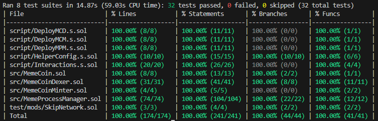

# Memtize Engine

**Memtize consists of:**

-   **Meme Coin**: Template for crafting new meme coins.
-   **Meme Coin Minter**: Contract responsible for minting meme coins among all participants (creator, memtize, funders, liquidity pool).
-   **Meme Coin Dexer**: Creating liquidity pool on Uniswap v3 and adding liquidity to it for newly crafted coins, so rest of community can trade that coin.
-   **Meme Process Manager**: Allows creating and funding memes. It automatically hype (listing on Uniswap v3) or kill (delete) based on time passed and funds gathered for each meme.

## Documentation

https://book.getfoundry.sh/

## Usage

### Build

```shell
$ forge build
```

### Test

```shell
$ forge test
```

#### Full Coverage

To get full coverage go to `test/mods/SkipNetwork.t.sol` find `skipForkNetwork()` modifier and comment it's if statement, then run below:

```bash
$ make testForkSepoliaCoverage
```



### Format

```shell
$ forge fmt
```

### Gas Snapshots

```shell
$ forge snapshot
```
