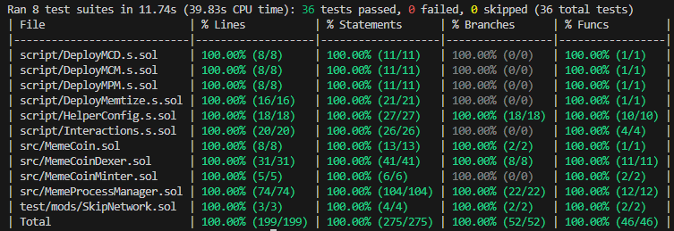
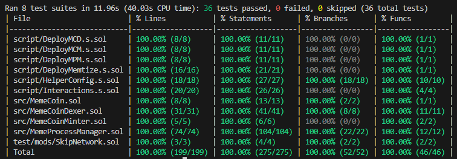

# Memtize

## **Website:** https://memetize.vercel.app/

### **Memtize consists of:**

-   **Meme Coin**: Template for crafting new meme coins.
-   **Meme Coin Minter**: Coins factory contract for minting meme coins among all participants (creator, memtize, funders, liquidity pool).
-   **Meme Coin Dexer**: Creating liquidity pool on Uniswap v3 and adding liquidity to it for newly crafted coins, so rest of community can trade that coin.
-   **Meme Process Manager**: Allows creating and funding memes. It automatically hype (listing on Uniswap v3) or kill (delete) based on time passed and funds gathered for each meme.

## 🔬 **What Is Memtize?**

Memtize is an innovative decentralized platform meticulously crafted to reward and appreciate meme creators. Leveraging the transformative power of blockchain technology and cryptocurrency, Memtize creates a distinctive ecosystem where memes are elevated into tradeable digital assets. This platform not only empowers creators to monetize their viral content but also fosters a vibrant community-driven marketplace where creativity and financial opportunities intersect.

#### **<u>What Problems It Solves?</u>**

-   **Monetization Challenges for Meme Creators:**

    -   _Problem:_ Meme creators often struggle to monetize their content despite its popularity and widespread sharing.
    -   _Solution:_ Memtize provides a platform where memes can be transformed into tradeable digital assets, allowing creators to earn cryptocurrency from their creations.

-   **Lack of Funding and Support for Meme Creators:**

    -   _Problem:_ Creators often lack the financial support needed to produce high-quality content.
    -   _Solution:_ Through community funding and voting, Memtize enables creators to gather the necessary funds to support their work and convert popular memes into cryptocurrency.

-   **Scam and Rug-Pull Risks:**

    -   _Problem:_ Many meme coin projects are associated with scams and rug pulls, where investors lose their money.
    -   _Solution:_ Memtize’s automated protocol ensures that all meme coins are rug-pull protected, decentralized, and legitimate, providing a secure investment environment.

-   **Liquidity and Trading Issues:**

    -   _Problem:_ New cryptocurrencies often face challenges in gaining liquidity and active trading.
    -   _Solution:_ Memtize supports the listing process and provides liquidity for meme coins on decentralized exchanges like Uniswap, ensuring active trading and stability.

-   **Lack of Refund Guarantees:**

    -   _Problem:_ Investors often fear losing their money if a project fails to gain traction.
    -   _Solution:_ Memtize offers a 100% refund guarantee if a meme fails to reach the necessary popularity and funding, making it a safe investment for contributors.

-   **Transparency and Decentralization:**
    -   _Problem:_ Traditional platforms often lack transparency and are prone to centralized control and manipulation.
    -   _Solution:_ Built on blockchain technology, Memtize ensures a decentralized and transparent platform, enhancing security and trust among users.

#### **<u>Key Features:</u>**

1. **Meme Creation and Funding:**

    - Users can create and share memes on the Memtize platform.
    - Memes that gain popularity and gather enough funds from the community are eligible for conversion into cryptocurrency.

2. **Meme to Crypto Conversion:**

    - Popular memes are converted into unique meme coins.
    - These meme coins are automatically listed on decentralized exchanges like Uniswap.

3. **Full Automation of Listing and Liquidity Providing:**

    - Memtize covers the entire listing process for successful memes.
    - We provide liquidity to ensure active trading and stability, eliminating the risk of rug pulls.

4. **Safe Funding and Refund Guarantee:**
    - Users can fund memes without fear of losing their investment.
    - If a meme fails to reach the necessary popularity and funding, contributors can receive a 100% refund.

#### **<u>How It Works:</u>**

1. **Create and Share:** Users create memes and share them on the Memtize platform.

2. **Fund and Vote:** Community members fund and vote on their favorite memes. The most popular memes with sufficient funds move forward.

3. **Conversion and Listing:** Successful memes are converted into meme coins and listed on decentralized exchanges like Uniswap, with Memtize providing liquidity support.

4. **Trade and Profit:** Users can trade meme coins on the exchange, benefiting from the value of popular memes. Contributors gain proportional value in meme coins, ensuring a fair return on their support.

#### **<u>Why Choose Memtize?</u>**

• **Decentralized and Transparent:** Built on blockchain technology, ensuring transparency and security.

• **Community-Driven:** Empowering meme creators and their fans to monetize creativity.

• **Risk-Free Investment:** With a refund guarantee, funding memes is a safe and rewarding experience.

• **Scam-Proof:** Our automated protocol ensures that coins are rug-pull protected, decentralized and only legitimate coins are crafted providing secure investment environment.

• **Active Trading Environment:** Providing liquidity to ensure smooth and active trading of meme coins.

_Join Memtize today and be part of a revolutionary platform where memes meet cryptocurrency, creating endless possibilities for creators and investors alike._

## 🚀 **Deployments**

#### **Sepolia:**

-   **MemeCoinMinter:** 0x1a5b3875066855c211CC95492344b2916730d1E6
-   **MemeCoinDexer:** 0xE9a85e8e3f437E819979fe68a15b2205a7e0b8f5
-   **MemeProcessManager:** 0x1Ce85D4d4dc2f4Df8C1Bd2F7Dce483EC3F0aa1F3

#### **Amoy:**

-   **MemeCoinMinter:** 0x9b48eD75cd5b758c94339f1Db298458aE226814D
-   **MemeCoinDexer:** 0xE56c44b93e1210Dd6FD40c589d528b1572488732
-   **MemeProcessManager:** 0xAE253FE1226B576800ac11352F77131a7E6835Dd

#### **Fuji:**

-   **MemeCoinMinter:** 0x89C9040709ebce46e3b68E75c2664653E9816c9B
-   **MemeCoinDexer:** 0xaBC27F4fa9dae4829575A3DF7958b9d80872c8a8
-   **MemeProcessManager:** 0x4B8907E0e9Ad03650E6f734d4bbb2Ce65a3dC27D

#### **Moonbeam:**

-   **MemeCoinMinter:** 0x89C9040709ebce46e3b68E75c2664653E9816c9B
-   **MemeCoinDexer:** 0xaBC27F4fa9dae4829575A3DF7958b9d80872c8a8
-   **MemeProcessManager:** 0x4B8907E0e9Ad03650E6f734d4bbb2Ce65a3dC27D

#### **Scroll:**

-   **MemeCoinMinter:** 0x32edbbEDbE769725F1bB8Acf9fB43E070eE77cd3
-   **MemeCoinDexer:** 0x590Fb54FEB1A3aBd8D2D853756F2172a3210c359
-   **MemeProcessManager:** 0x4f848df81370275ABFBD91E798E4Cddc48A8BBac

## 💻 **Usage**

#### **For local partial usage follow below:**

-   Install `Foundry`
-   Create and fill `.env` file same as it is shown in `.env.example`
-   Run `anvil` command in terminal
-   Open new terminal window without closing one with `anvil`
-   Run `make deployMemtize` to deploy whole blockchain part of this project
-   Now you can play with it's basic functions from `MemeProcessManager` contract

#### **Full usage:**

You need to fork one of mainnets (Ethereum, Polygon, Avalanche) or just use testnet (Sepolia). As our protocol cooperates with Uniswap v3 it is fully usable only on mentioned networks as there are Uniswap contracts deployed officially by Uniswap Labs.

### 🧪 **Test**

```shell
$ forge test
```

### 🧪 **Full Test Coverage**

To get full coverage go to `test/mods/SkipNetwork.t.sol` find `skipForkNetwork()` modifier and comment it's if statement, then run below:

-   **Mainnet**

*   `make testForkMainnet`
*   `make testForkMainnetCoverage`

-   **Sepolia Testnet**

*   `make testForkSepolia`
*   `make testForkSepoliaCoverage`

-   **Polygon**

*   `make testForkPolygon`
*   `make testForkPolygonCoverage`

-   **Avalanche**

*   `make testForkAvalanche`
*   `make testForkAvalancheCoverage`

Our protocol has been tested fully on all above networks and has reached below results:

#### <u>**Ethereum Mainnet**</u>:



#### <u>**Sepolia**</u>:



#### <u>**Polygon**</u>:


#### <u>**Avalanche**</u>:


## 📃 **Documentation**

https://book.getfoundry.sh/

### ⌨ **Commands**

You can find all useful commands in `Makefile`

#### **Build**

```bash
$ forge build
```

#### **Format**

```bash
$ forge fmt
```

#### **Gas Snapshot**

This one is set to Mainnet, so first go to `test/mods/SkipNetwork.sol` find `skipForkNetwork()` modifier and comment it's if statement

```bash
$ make snapshot
```


